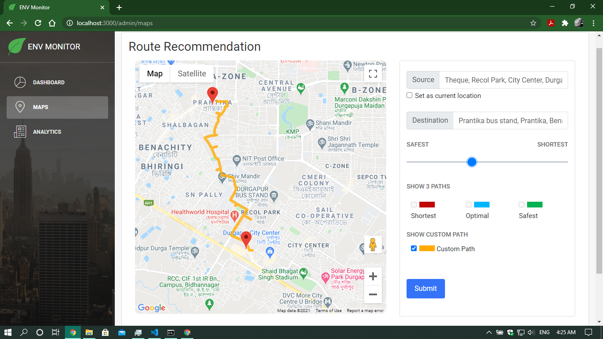

# ENV Monitor 

A front-end solution for route recommendation with AQI consideration and corresspoinding pollution analysis over a small area of Durgapur, West Bengal, India.

## Dashboard

24 hrs performance over the whole area and PoIs lying in the area with the corressponding AQI of their location.

_Heatmap_

_Map with Marker Info for a PoI_

_PoIs_

## Route Recommendation

Route Recommendation with AQI consideration. Shows Safest, Optimal, Shortest path or path with custom AQI settings.

_All possible paths_

_Path with custom AQI_

## Analytics

Air Quality Index Analysis over the area of interest for 7 days as well as daily.

---

## Template Used

**[Light Bootstrap Dashboard React](https://demos.creative-tim.com/light-bootstrap-dashboard-react/#/?ref=lbdr-readme)** is an admin dashboard template designed to be beautiful and simple. It is built on top of [React Bootstrap](https://5c507d49471426000887a6a7--react-bootstrap.netlify.com/), using [Light Bootstrap Dashboard](https://www.creative-tim.com/product/light-bootstrap?ref=lbdr-readme) and it is fully responsive. It comes with a big collections of elements that will offer you multiple possibilities to create the app that best fits your needs. It can be used to create admin panels, project management systems, web applications backend, CMS or CRM.

## Template Licensing

- Copyright 2018 Creative Tim (https://www.creative-tim.com?ref=lbdr-readme)
- Licensed under MIT (https://github.com/creativetimofficial/light-bootstrap-dashboard-react/blob/master/LICENSE.md)

---

Made in :heart: with [React](https://reactjs.org/).

## Contributors

